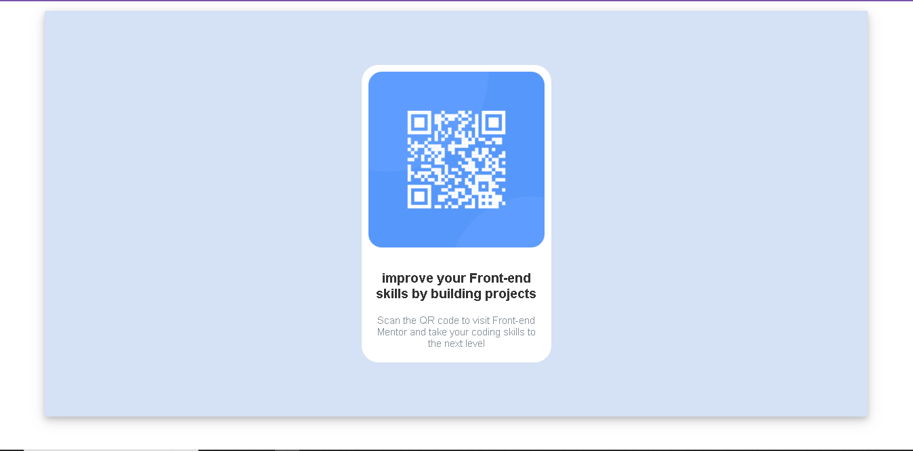

# Frontend Mentor - QR code component solution

This is a solution to the [QR code component challenge on Frontend Mentor](https://www.frontendmentor.io/challenges/qr-code-component-iux_sIO_H). Frontend Mentor challenges help you improve your coding skills by building realistic projects. 

## Table of contents

- [Overview](#overview)
  - [Screenshot]
- [My process]
  - [Built with
  - [What I learned]
  - [Continued development]
  - [Useful resources]
- [Author]


## Overview
This a solution of QR code component challenge ,i did it using visual studio code ,which i have installed extensions for html and css.


### Screenshot



### Links

- Solution URL:(index.html)

## My process

### Built with

- Semantic HTML5 markup
- CSS
- Flexbox
- CSS position

### What I learned
-I have learnt how to design a website that its content align in center
-making a website responsive by use of flex property
-use of classes to style a website
-different type of position property in css

code sniplets

```html
<div class="qr-code-wrapper">
  <div class="wrapper">
      
      <div class="content">
        <h3 style="font-family:Arial;font-weight: 700;">improve your Front-end skills by building projects</h3>
        <p style="font-size:15px;font-family:Arial;font-weight:400;color: hsl(213, 10%, 45%)">Scan the QR code to visit Front-end Mentor and take your coding skills to the next level</p>
       </div>
    </div>

</div>
```
```css
.attribution { font-size: 11px; text-align: center; }
    .attribution a { color: hsl(228, 45%, 44%); }
    body{
        padding: 0%;
        margin: 0%;

    }

    .qr-code-wrapper{
      background-color:hsl(218, 59%, 87%);
      margin: 10% 5% 10% 5%;
      position: relative;
      display: flex;
      justify-content: center;
      align-items: center;
      height: 600px;
      box-shadow: 0 4px 8px 0 rgba(0, 0, 0, 0.2), 0 6px 20px 0 rgba(0, 0, 0, 0.19);
      opacity: 0.8;
    }
    .wrapper{
      display: flex;
      position: relative;
      flex-direction: column;
      justify-content: center;
      align-items: center;
      background-color:hsl(0, 0%, 100%);
      width:280px;
      border-radius: 25px;
    }
   img{
     border-radius: 20px;
     margin: 10px;
   }
   .content{
     margin: 5px 20px;
     text-align: center;
}
```

### Continued development
i want to do some javascript and react projects.

### Useful resources
-[flex css property]-[https://www.w3schools.com/css/default.asp]
-[box-shadow]-[https://www.w3schools.com/css/default.asp]

## Author

- Frontend Mentor - [@yourusername](https://www.frontendmentor.io/profile/ianmwendwa-byte)
- Twitter - [@yourusername](https://www.twitter.com/Eantodj)

